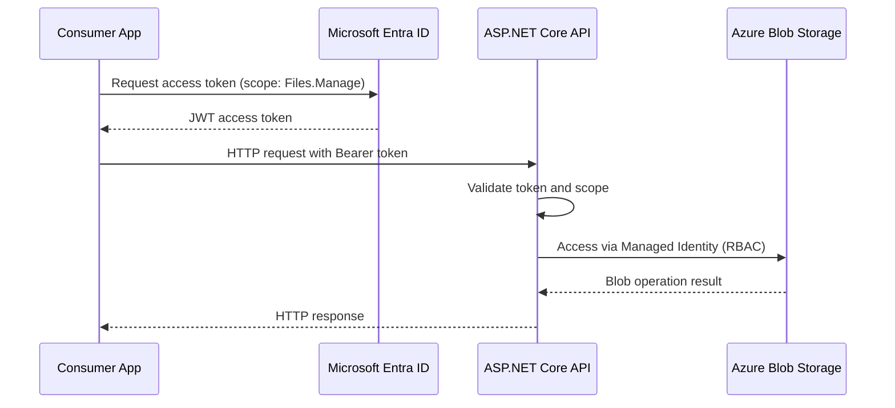
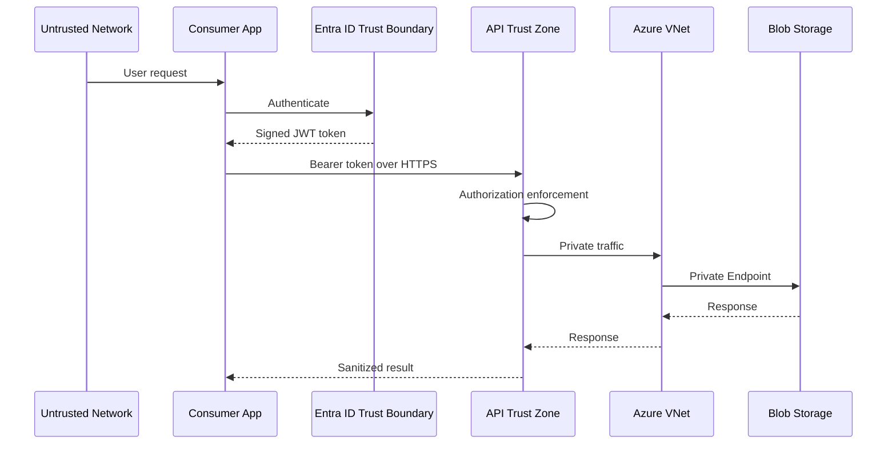

# Azure Blob Storage API

<p align="center">
  
  
  
</p>

<p align="center">
<a href="https://github.com/tomblanchard312/AzureBlobStorageAPI/actions/workflows/dotnet-build-test.yml">
  
</a>
<a href="https://github.com/tomblanchard312/AzureBlobStorageAPI/actions/workflows/codeql.yml">
  
</a>
<a href="https://codecov.io/gh/tomblanchard312/AzureBlobStorageAPI">
  
</a>
</p>

A modern .NET 8 Web API for uploading, listing, and downloading files backed by Azure Blob Storage.  
The solution uses Azure Bicep for infrastructure, Microsoft Entra ID for authentication, Managed Identity for storage access, private networking, and CI validation for infrastructure templates.

---

## Table of Contents

- [Overview](#overview)
- [Architecture](#architecture)
- [Security Architecture](#security-architecture)
- [Prerequisites](#prerequisites)
- [Getting Started](#getting-started)
- [Configuration](#configuration)
- [Local Development](#local-development)
- [API Usage](#api-usage)
- [Deployment](#deployment)
- [CI and Quality Gates](#ci-and-quality-gates)
- [Contributing](#contributing)

---

## Overview

The API exposes endpoints to upload, list, and download files. Responsibilities are split across components:

- Controllers/FileManagerController.cs: HTTP endpoints and exception translation
- Services/FileManagementService.cs: Business rules and per-user container naming using Entra ID claims
- Services/BlobStorageRepository.cs: Azure Blob Storage access via SDK
- Program.cs: Dependency injection, authentication, authorization, and health checks

---

## Architecture

High-level request flow:

```
Client → API → Azure Blob Storage
```

Key characteristics:

- OAuth2 and JWT authentication via Microsoft Entra ID
- Managed Identity for storage access
- Per-user isolation using the Entra ID oid claim
- Private Endpoint and Private DNS for Blob Storage
- Infrastructure defined using modular Azure Bicep

---

## Security Architecture

### Authentication and Authorization Flow



---

### Failure Boundaries and Trust Zones



---

## Prerequisites

- .NET 8 SDK
- Azure subscription with permissions for App Service, Storage, Networking, and Entra ID app registrations

---

## Getting Started

```bash
git clone https://github.com/tomblanchard312/AzureBlobStorageAPI.git
cd AzureBlobStorageAPI/NetCoreAzureBlobServiceAPI
dotnet build
```

---

## Configuration

- Blob Storage endpoint injected via App Service settings
- No storage keys or connection strings
- Allowed extensions configured in FileManagementService
- Max file size 100 MB

---

## Local Development

```bash
dotnet restore
dotnet build
dotnet test
```

Health check: GET /health

---

## API Usage

POST /api/FileManager/upload  
GET /api/FileManager/list  
GET /api/FileManager/download?blobName=name

---

## Deployment

Infrastructure is defined under NetCoreAzureBlobServiceAPI/infra using Bicep.

---

## CI and Quality Gates

- Build and test workflows
- CodeQL static analysis
- Infrastructure validation with az bicep build and ARM validate

---

## Contributing

Run dotnet format and dotnet test before submitting changes.

For security issues see SECURITY.md.
